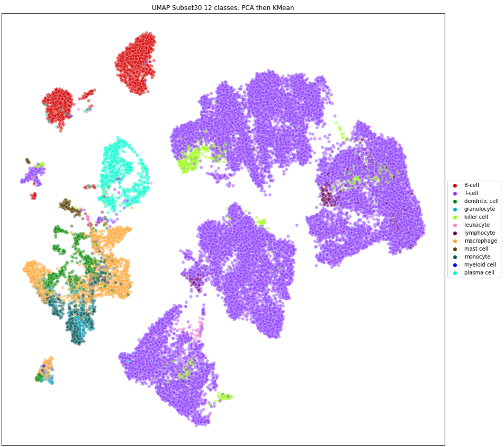

single-cell_classification
==============================

## 1.	Background and Task 

When there are tumour cells, immune cells infiltrate into the tumour to kill tumour cells. In order to investigate drug performances to cure cancers, it is necessary to develop a tool to classify immune cells inside tumours before and after the patients get their treatments. This tool can compare which cells still exist inside the tumours and which ones have disappeared due to the treatment, Figure 1.   
To develop a tool to classify cells inside the tumours the single-cell reference Atlas was used to create a cell type classifier. This tool can then automatically assign cell labels to new single-cell studies. 

 

 

Figure 1 Cell Classification

All icons used in this report are from [flaticon](https://www.flaticon.com/) 

## 2.	Features Descriptions 
- 3,000 genes  
- 108,000 cells with 43 different cell types. 43 number of cell types is the maximum number of cell types used for the classifier. 

## 3.	Methodology 

### Part 1: Data Conversion     
RDS data is converted to h5ad data (AnnData) format so that it can be used and transformed to csv file by Python.  

**File needed:**  
convert_rds_to_h5Seurat.R

### Part 2: Data Exploration  
Structure of dataset was investigated.  

**File needed:**  
Explore_Data.ipynb

### Part 3: Data Reduction  
The original dataset is reduced to implementable dataset sizes, Figure 2.  
- **Test Dataset:** Original dataset reduced to 30% in a **random** fashion. Like the original, the test dataset set is unbalanced. This means that some cell types occur more frequently than others.This dataset is used in the unsupervised learning model to generate clusters and in the Supervised learning model as a Test Dataset (unseen dataset). 
- **Train Dataset Unbalanced:** Original dataset reduced to 10% in a **random** fashion. Like the original, this train dataset set is unbalanced. This dataset will be used for supervised machine learning. The “Train Dataset” will be split into 80% and 20%, train and test dataset to train and evaluate the supervised models, respectively.
- **Train Dataset Balanced:** Original dataset reduced to 10% in a **nonrandom** fashion in order to make the dataset more balanced. 
To achieve this a specific number of cells were selected from each cell type. Those least number of cells than others, all cell amount where taken into this train dataset. This dataset will be used for supervised Machine Learning. The “Train Dataset” will be split into 80% and 20%, train and test dataset to train and evaluate the supervised models, respectively.

 

 

  

Figure 2 Data Reduction with File Names

Since the test dataset will later be used to test the supervised models, it was necessary to ensure that all cells in the test dataset would not end up in the train datasets. To achieve this, we excluded the test dataset from the original before generating the train datasets from it.

**File needed:**  
generate_subset.ipynb

### Part 4: Unsupervised Machine Learning Model   
Hierarchical unsupervised machine learning model is developed to classify cells based on cell types (denoted as “cell_type” in the dataset). The dataset dimension is reduced by using the Principal Component Analysis (PCA) to perform linear dimensional reduction then the Uniform Manifold Approximation and Projection (UMAP) is used to do a 2D plot for a scatter visualization. This method is widely performed in gene expression problems - see more info [Seurat - Guided Clustering Tutorial](https://satijalab.org/seurat/articles/pbmc3k_tutorial.html) . Then the “Kmeans” clustering, together with “Predicted Classes” from the supervised model, is used to label cell types in this plot. 

 

Figure 3 UMAP

**File needed:**    
Unsupervised_ML.ipynb                   

### Part 5: Supervised Machine Learning Model   
Two sets of number of cell types were explored, 43 and 12 cell types, respectively. These are denoted as “12 Class” and “43 Classes” throughout the project. Each number of cells were explored using balanced and unbalanced dataset as described in Figure 2.   
Additional supervised models were developed based on a given dataset, which dimension has been reduced using a PCA method. 
In this case an overview of the performance of different machine learning algorithms was performed to figure out which one should be used. 

**Files needed:**   
ML_model_12classes_unbalanced.ipynb     
ML_model_12classes_balanced.ipynb       
ML_model_43classes_unbalanced.ipynb     
ML_model_43classes_balanced.ipynb       
ML_pca_overview.ipynb                   
ML_pca_12classes.ipynb                  
ML_pca_43classes.ipynb                  

See all files needed in each step in Figure 2.   

### Part 6: Model Interpretation   

In this part we only looked at the model that shows the best performance which used all 3,000 features. 
It was a model that can predict 12 classes and was trained on unbalanced data.

The feature importance of each cell type was extracted from the model and the 20 most influential features were plotted.
These values represent the impact each gene has in deciding if a cell belongs to a certain cell type or not.

To check if the feature importance values make sense, some gene expression plots were generated by colouring the UMAP plot from the unsupervised machine learning based on the expression of the gene.

In order to evaluate the models the predicted cell types were plotted. 
This was achieved by colouring the UMAP plot from the unsupervised machine learning based on the correctnes of the prediction.

**Files needed:**   
model_interpretation_per_classes.ipynb  
UMAP_plots_predicted_data.ipynb   

## 4.	Results  

The overall best performing model could classify 12 different cell types and was trained on the PCA data. 
It reached an accuracy and weighted F1 score of 96%.
However, the macro F1 score was only 74%.
This means that the model performs very well when predicting cells that belong to major cell types but does not perform as well when it comes to minor cell types.

When looking at the feature importance scores and the gene expressions we could see that they correlate very well. 
This means that the model based the classification on reasonable observations.

## 5.	Outlook  

By excluding some features the model can be simplified and may provide a better performance. 
The most significant genes, based on “Feature Importance” (output described earlier) can be selected and used to train the model. 
Genes with less significant features will be excluded. 

In addition, Hyperparameters could also be included in the models to increase the model performance. 

## Note: Lists of Files  

convert_rds_to_h5Seurat.R               
Explore_Data.ipynb                      
generate_subset.ipynb                   
ML_model_12classes_unbalanced.ipynb     
ML_model_12classes_balanced.ipynb       
ML_model_43classes_unbalanced.ipynb     
ML_model_43classes_balanced.ipynb       
ML_pca_12classes.ipynb                  
ML_pca_43classes.ipynb                  
ML_pca_overview.ipynb                   
model_interpretation_per_classes.ipynb  
UMAP_plots_predicted_data.ipynb         
Unsupervised_ML.ipynb                   

Project Organization
------------

    ├── LICENSE
    ├── Makefile           <- Makefile with commands like `make data` or `make train`
    ├── README.md          <- The top-level README for developers using this project.
    ├── data
    │   ├── external       <- Data from third party sources.
    │   ├── interim        <- Intermediate data that has been transformed.
    │   ├── processed      <- The final, canonical data sets for modeling.
    │   └── raw            <- The original, immutable data dump.
    │
    ├── docs               <- A default Sphinx project; see sphinx-doc.org for details
    │
    ├── models             <- Trained and serialized models, model predictions, or model summaries
    │
    ├── notebooks          <- Jupyter notebooks. Naming convention is a number (for ordering),
    │                         the creator's initials, and a short `-` delimited description, e.g.
    │                         `1.0-jqp-initial-data-exploration`.
    │
    ├── references         <- Data dictionaries, manuals, and all other explanatory materials.
    │
    ├── reports            <- Generated analysis as HTML, PDF, LaTeX, etc.
    │   └── figures        <- Generated graphics and figures to be used in reporting
    │
    ├── requirements.txt   <- The requirements file for reproducing the analysis environment, e.g.
    │                         generated with `pip freeze > requirements.txt`
    │
    ├── setup.py           <- makes project pip installable (pip install -e .) so src can be imported
    ├── src                <- Source code for use in this project.
    │   ├── __init__.py    <- Makes src a Python module
    │   │
    │   ├── data           <- Scripts to download or generate data
    │   │   └── make_dataset.py
    │   │
    │   ├── features       <- Scripts to turn raw data into features for modeling
    │   │   └── build_features.py
    │   │
    │   ├── models         <- Scripts to train models and then use trained models to make
    │   │   │                 predictions
    │   │   ├── predict_model.py
    │   │   └── train_model.py
    │   │
    │   └── visualization  <- Scripts to create exploratory and results oriented visualizations
    │       └── visualize.py
    │
    └── tox.ini            <- tox file with settings for running tox; see tox.readthedocs.io

--------

<small>Project based on the <a target="_blank" href="https://drivendata.github.io/cookiecutter-data-science/">cookiecutter data science project template</a>. #cookiecutterdatascience</small>

